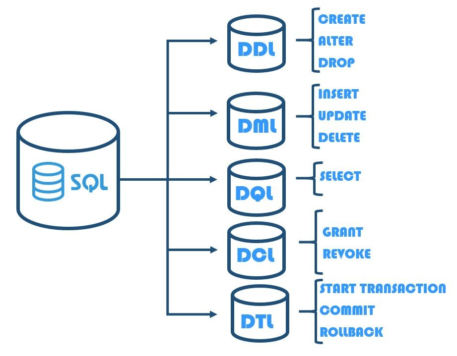

# Day 02 - First database queries

The objective is to perform the first SQL basic querys.

### Challenge
1. Get all columns from the Customers, Orders, and Suppliers tables.

```sql
SELECT * FROM customers;
SELECT * FROM orders;
SELECT * FROM suppliers;
```

2. Get all Customers in alphabetical order by country and name.

```sql
SELECT * FROM customers
ORDER BY country, company_name;
```

3. Get the 5 oldest orders.

```sql
SELECT * FROM orders
ORDER BY order_date ASC
LIMIT 5;
```

4. Get the count of all orders made during 1997.

```sql
SELECT COUNT(order_date) AS count_orders_1997
FROM orders
WHERE order_date BETWEEN '1997-01-01' AND '1997-12-31';
```

5. Get the names of all contact persons where the person is a manager, in alphabetical order.

```sql
SELECT contact_name, contact_title
FROM customers
WHERE contact_title LIKE '%Manager%'
ORDER BY contact_name;
```

6. Get all orders made on May 19, 1997.

```sql
SELECT *
FROM orders
WHERE order_date = '1997-05-19';
```

### Notes
- **SQL**: Structured Query Language
    * Declarative language, which means that you specify what data you want to retrieve or manipulate, rather than specifying how to retrieve it. You write SQL queries to describe the desired result set, and the database system determines the most efficient way to execute the query.
    *  The database system typically executes them in the most efficient manner based on its query optimizer and execution plan. This means that the database engine may reorder or optimize the query execution to improve performance while still producing the correct results.

- **Login/Group Roles**: Refer to the concept of user accounts and groups that are used for authentication and authorization purposes.

- **Subcategories of SQL**
    - *DQL (Data Query Language)*
        - Consists of commands used to retrieve data from the database. 
        - *Users*: Analysts, Data Scientists, Database Developers

    - *DML (Data Manipulation Language)*
        - Used to manipulate data stored in the database.
        - *Users*: Application Developers, Database Administrators

    - *DDL (Data Definition Language)*
        - Commands used to define the structure of the database and its objects.
        - *Users*: Database Administrators, Database Developers
    - *DCL (Data Control Language)*
        - Commands used to control access to data stored in the database.
        - *Users*: Database Administrators, Security Administrators

    - *DTL (Data Transaction Language)*
        - Not a standard subcategory, but transactions typically fall under the broader categories of DML and DDL. Transactions are used to group one or more SQL statements into a single unit of work.
        - *Users*: Application Developers, Database Administrators



- **BEGIN COMMIT ROLLBACK** → Like Python's Try-Except

- **DQL Operations**
    - `SELECT`  → Controls at the column level
    - `WHERE` → Controls at the row level
        - `>`, `<`, `=`
        - `<>` → Not equal to
        - `OR`, `AND`, `NOT`
        - `IS` null or `IS NOT` null → for missing data
        - `LIKE` → For strings (heavy operation)
            - `a%` → Starts with the letter a
            - `%a` → Ends with the letter a
            - `%or%` → Contains 'or' in the middle of the name
            - Combine with `UPPER` and `LOWER` for better performance
            - `a__%` → Starts with a and has at least 3 characters (`_`)
        - `ILIKE`  → No need to use `UPPER` or `LOWER`
        - `SILIMAR TO` → Also for queries
        - `IN` → Recommended to be used in subqueries
        - `BETWEEN` → Between two values
            - In the case of strings, filters those that are alphabetically within the range
        - `ORDER BY`
    - Aggregating Functions
        - Used after `SELECT`
        - `MIN`, `MAX`, `COUNT`, `AVG`
        - Most aggregate functions ignore NULL values, except `COUNT(*)`

--------------
[Class Repository](https://github.com/lvgalvao/data-engineering-roadmap/tree/main/Bootcamp%20-%20SQL%20e%20Analytics/Aula-02)


