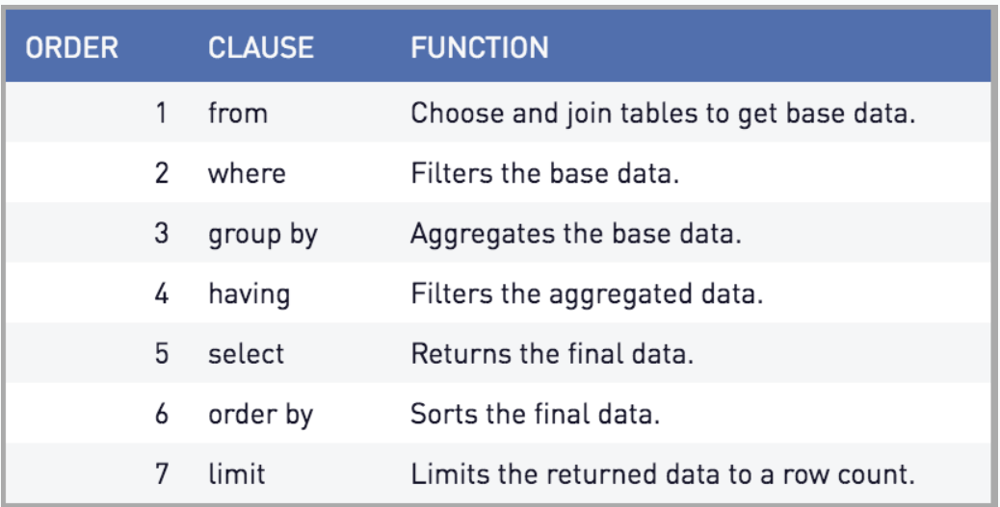

# Day 03 - Joins and Having  

The objective was to perform `JOIN` and `HAVING` commands.

### Challenge

1. Creates a report for all orders from 1996 and their customers (152 rows)

```sql
SELECT * 
FROM orders o 
INNER JOIN customers c
ON o.customer_id = c.customer_id
WHERE EXTRACT(YEAR FROM o.order_date) = 1996;
-- Another option
SELECT * 
FROM orders o 
INNER JOIN customers c
ON o.customer_id = c.customer_id
WHERE DATE_PART('YEAR', o.order_date) = 1996;
```

2. Creates a report showing the number of employees and customers for each city that has employees (5 rows)

```sql
SELECT e.city,
	COUNT(DISTINCT c.customer_id) AS number_customers,
	COUNT(DISTINCT e.employee_id) AS number_employee
FROM employees e 
LEFT JOIN customers c ON e.city = c.city
GROUP BY e.city
ORDER BY e.city;
```
3. Creates a report showing the number of employees and customers for each city that has customers (69 rows)

```sql
SELECT c.city,
	COUNT(DISTINCT c.customer_id) AS number_customers,
	COUNT(DISTINCT e.employee_id) AS number_employee
FROM employees e 
RIGHT JOIN customers c ON e.city = c.city
GROUP BY c.city
ORDER BY c.city;
```

4. Creates a report showing the number of employees and customers for each city (71 rows)

```sql
SELECT
	COALESCE(e.city, c.city),
	COUNT(DISTINCT e.employee_id) AS numero_de_funcionarios,
	COUNT(DISTINCT c.customer_id) AS numero_de_clientes
FROM employees e 
FULL JOIN customers c ON e.city = c.city
GROUP BY e.city, c.city
ORDER BY e.city, c.city;
```
5. Creates a report showing the total quantity of ordered products. Show only records for products for which the ordered quantity is less than 200 (5 rows)

```sql
SELECT p.product_id, p.product_name,
	SUM(o.quantity) AS total_quantity
FROM products p
LEFT JOIN order_details o ON p.product_id = o.product_id
GROUP BY p.product_id, p.product_name
HAVING SUM(o.quantity) < 200
ORDER BY p.product_id;
```

6. Creates a report showing the total number of orders per customer since December 31, 1996. The report should return only rows for which the total orders is greater than 15 (5 rows)

```sql
SELECT customer_id, COUNT(order_id) AS total_orders
FROM orders
WHERE order_date > '1996-12-31'
GROUP BY customer_id
HAVING COUNT(order_id) > 15
ORDER BY total_orders;
```


### Notes
- **Database Normalization**: The process of organizing data in a database. It involves creating tables and establishing relationships between these tables according to rules designed to protect data and make the database more flexible, eliminating redundancy and inconsistent dependency.
- **Identification Keys** 
    - Primary → uniquely identifies each record in a table.
    - Foreign → establishes a relationship with the primary key in another table.
- **SQL Execution Order**

- **Types of Joins**
    -  **Inner Join**: Returns records that have a match in both tables.
    -  **Left Join (or Left Outer Join)**: Returns all records from the left table and the matching records from the right table. If there is no match, the results from the right table will have `NULL` values.
    -  **Right Join (or Right Outer Join)**: Returns all records from the right table and the matching records from the left table. If there is no match, the results from the left table will have `NULL` values.
    -  **Full Join (or Full Outer Join)**: Returns records when there is a match in one of the tables. If there is no match, still, the result will appear with `NULL` in the fields from the table without a match.
- **Join structure**
    ```sql
    SELECT * 
    FROM orders o 
    INNER JOIN customers c
    ON o.customer_id = c.customer_id;
    ```
    - The letters `o` and `c` are the identifier shortcuts for the tables, to select specific columns.
    - By default, any unspecified `JOIN` is an `INNER JOIN`.
- **Having**
    - Since `WHERE` is triggered before `GROUP BY`, `HAVING` is used because it comes after.

- **Others commands**
    - `EXTRACT`
        - `EXTRACT(part FROM date)` part can be `YEAR`, `MONTH`, `DAY`, etc.
    - `COALESCE` → returns the first non-null expression among its arguments.

--------------
[Class Repository](https://github.com/lvgalvao/data-engineering-roadmap/tree/main/Bootcamp%20-%20SQL%20e%20Analytics/Aula-03)


